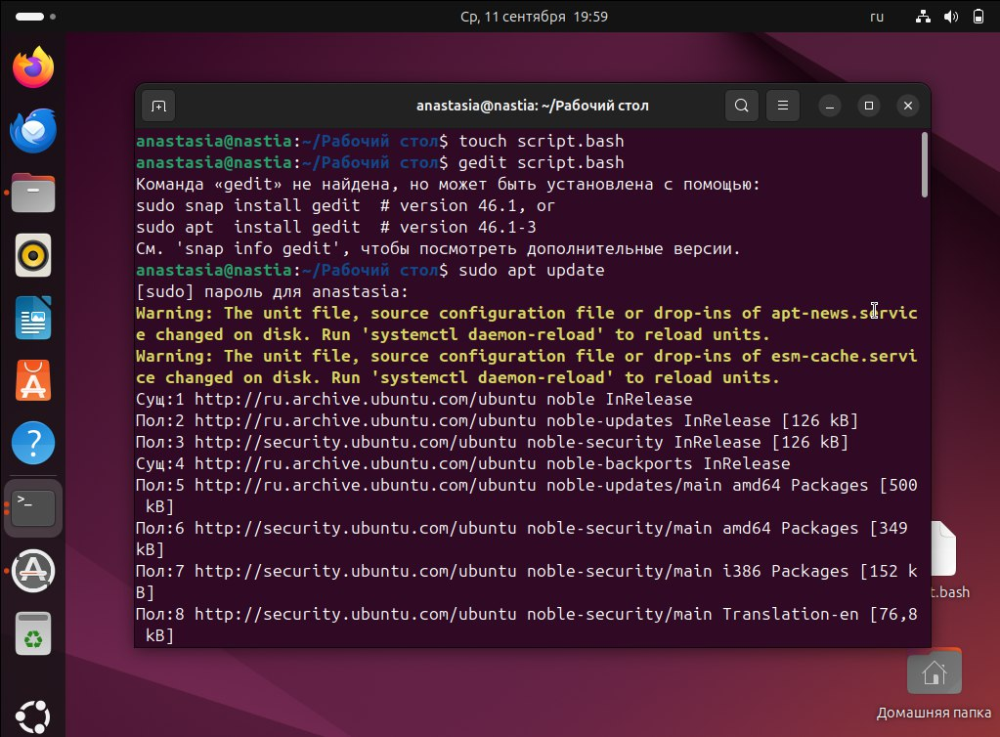

# Панас Анастасия Андреевна, группа K3162, номер ИСУ 467006
1) Первым делом я установила на свое устройство виртуальную машину Hyper-V с установленным дистрибутивом Ubuntu
2) Открыла эмулятор терминала (командную строку) и начала выполнение лаборатороной работы в соответствии с прописанными в задании пунктами
3) Создала новый файл с именем _script.bash_
>touch script.bash

Далее в соответсвии со 2 пунктом лабораторной работы нужно было открыть данный файл для редактирования в редакторе _gedit_
>gedit script.bash

Однако команда gedit не была найдена и потребовалась ее установка

Для этого я ввела в терминал
>sudo apt update

>sudo apt install gedit

После установки редактора gedit я вернулась к выполнению пунктов прописанных в Лабораторной работе

4) Вписала в редакторе скрипт

>#!/bin/bash

>echo "Welcome to ITMO University

5) Сохранив файл, я закрыла текстовый редактор и запустила bash-скрипт выполнив терминале

>bash script.bash

И как и требовалось в терминале отобразилась строка 
>Welcome to ITMO University

6) Далее я приступила к редактированию файла в gedit для выполнения самого задания работы, прочитав дополнительную информацию о специальных типах переменных, я нашла информацию о специальных переменных _$*_ и _$@_, которые содержат все аргументы командной строки

Так в gedit'е я заменила 
>echo "Welcome to ITMO University

на
>echo "Welcome:"$*

7) Проверила выполнение, закрыв текстовый редактор и вписав в терминале скрипт
>bash script.bash Vasya Pupkin

В терминале отобразилась строка 
>Welcome:Vasya Pupkin

Однако, как требоввалось в ТЗ, в результате выполнения Лабораторной работы должна выводиться строка "Welcome, * аргументы командной строки (имя)*

Я допустила ошибку в вводе знаков препинания в текстовом редакторе, однако основное задание выполнилось верно

8) Вношу изменения в текстовом редакторе
>echo "Welcome, "$*

9) Проверяю выполнение задания на сложном примере, данном в задании

>bash script.bash Benedict Timothy Carlton Cumberbatch

И получаю в терминале необходимую строку

>Welcome, Benedict Timothy Carlton Cumberbatch

